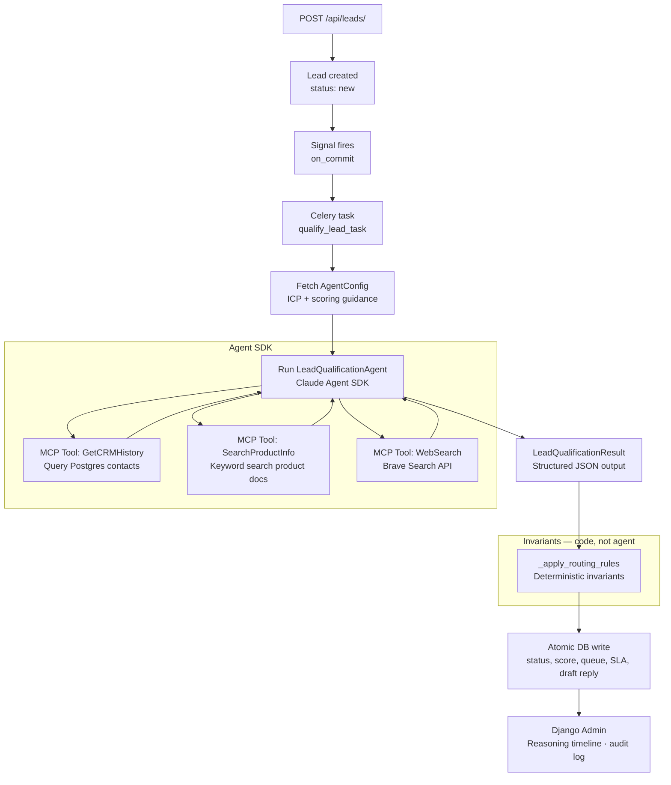

# django-lead-agent

Event-driven lead qualification using the Claude Agent SDK, Django, and Celery. A lead arrives via API, a background agent researches it across multiple data sources, and a structured result — scored, routed, and reply-drafted — is written to the database before any human touches it.

The architecture is domain-agnostic; the leads domain can be swapped for any business workflow triggered by a database event.


https://github.com/user-attachments/assets/48965cbd-081d-4016-97df-fed1495ae28a


---

## Architecture



---

## Three-layer design

| Layer | Who controls it | What it does |
|---|---|---|
| **Configuration** | Business owner, via Django admin | Edits ICP description, scoring guidance, routing thresholds — no code deploy needed |
| **Agent judgment** | Claude | Scores ICP fit, reasons across CRM + docs + web, drafts personalized reply |
| **Invariants** | Code (`_apply_routing_rules`) | Enforces routing queue and SLA deadline — agent output is advisory, rules always win |

---

## Stack

- **Django 5.1** — ORM, admin, REST API (DRF)
- **Celery + Redis** — async task queue; agent runs in a worker process
- **PostgreSQL** — leads, CRM contacts, product docs, routing rules, audit log
- **Claude Agent SDK** — in-process MCP server, structured output, PostToolUse hooks
- **Brave Search API** — web enrichment for unknown companies (optional)

---

## Quick start

```bash
cp .env.example .env
# Add ANTHROPIC_API_KEY (and optionally BRAVE_API_KEY) to .env

docker-compose up --build -d
docker-compose exec web python app/manage.py migrate
docker-compose exec web python scripts/seed_data.py
docker-compose exec web python app/manage.py createsuperuser
```

Django admin: http://localhost:8001/admin/
Flower (Celery monitor): http://localhost:5555/

**Submit a live lead:**
```bash
curl -X POST http://localhost:8001/api/leads/ \
  -H "Content-Type: application/json" \
  -d '{"name": "Jane Smith", "email": "jane@acme.com", "company": "Acme Corp",
       "role": "Head of Operations", "message": "We process 100+ POs per month manually and need to automate approvals."}'
```

**Run the agent directly (no Celery):**
```bash
docker-compose exec web python app/manage.py test_agent --email jane@acme.com
```

**Print a full agent run report:**
```bash
docker-compose exec web python app/manage.py agent_report <lead_id>
```

---

## Key takeaway

Most teams use AI for one-shot tasks. This is event-driven agentic automation — a business event triggers a background agent that reasons across multiple data sources, produces a structured decision, and hands off to deterministic code. No human initiated it. It ran because a lead arrived.
